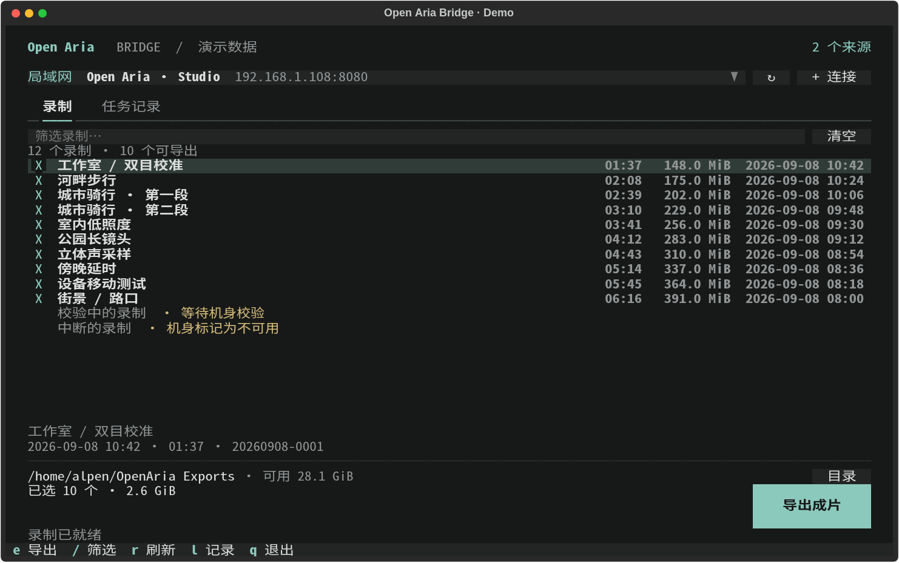
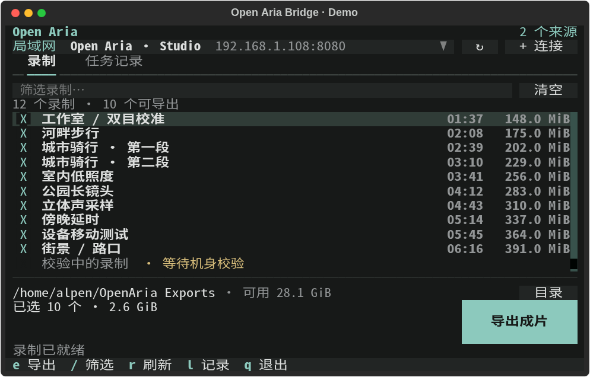
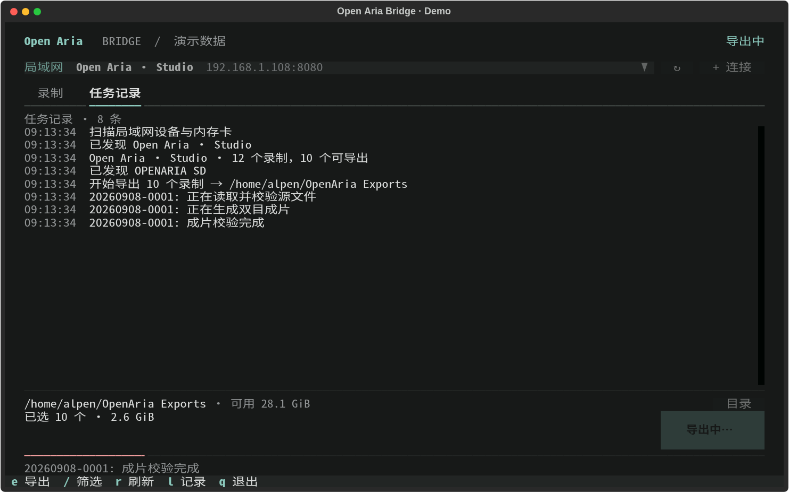

# TUI Rewrite And Ablation

Branch: `refactor/tui-workbench`.
Baseline: `1bc290c24553b1dba2b0d8c58b43ab8ce6275a03`.

## Product Target

Bridge is a human-operated workflow tool for discovering recordings, selecting
them, and exporting verified stereo videos. The primary interaction is a TUI;
the Python SDK is the separate automation contract. The process holds temporary
discovery, selection, and task state. It has no durable TUI session identity.

Discovery and listing are read operations. Export writes local outputs and
must preview the selection, validate the destination, check free space, and
preserve the SDK's verification and atomic publication. The TUI offers no
source deletion or remote publication operation. CLI arguments remain limited
to help and version; no machine protocol is inferred from terminal output.

The design prioritizes a short path from source to playable video, compact
terminal controls, and recoverable failures. It takes visual cues from terminal
workbenches such as Codex: a quiet header, a primary content region, restrained
color, and a stable action area. It does not introduce a chat input or an agent
runtime into a recording exporter. No third-party interface code was copied.

## Baseline And Experiments

Before implementation, the unmodified baseline passed all **157 tests**. Only
three tests exercised the actual TUI; two more covered CLI entry behavior.
The ablation harness uses those same fake SDK fixtures, Textual Pilot, and the
real layout engine. No physical device or subjective user study was involved.

| Experiment | Baseline | Ablated Variant | Decision |
| --- | --- | --- | --- |
| Source hash | SHA-256 of mode and location | Plain mode/location identity; all three existing TUI scenarios pass | Remove hashing and the redundant option-ID lookup |
| Source cursor | One initial session read, two after highlighting another source | One initial read, still one after highlighting | Read only after a committed source choice |
| 120x36 list area | 68 columns x 17 rows | 110 columns x 21 rows after removing the fixed source pane, panel borders, and excess spacing | Replace the permanent source pane with a native compact selector |
| 80x24 list area | 66 columns x 1 row | 70 columns x 10 rows with the same removals | Give recordings the remaining full-width content area |

The layout variant deliberately removes source navigation to isolate its space
cost. It is an experiment, not a shippable UI. The final implementation restores
source navigation with Textual's `Select`, and measures **114x18** list cells at
120x36, **78x11** at 80x24, and **46x5** at 48x18. Those are viewport dimensions,
not claims about export speed or user satisfaction.

### Reproduce The Ablation

The experiment must run with the baseline checkout as its working directory.
Use the development environment from the rewrite checkout, with the harness
path adjusted to that checkout:

```bash
git worktree add --detach /tmp/openaria-tui-baseline 1bc290c24553b1dba2b0d8c58b43ab8ce6275a03
cd /tmp/openaria-tui-baseline
uv run --project /path/to/openaria-bridge-sdk --locked python /path/to/openaria-bridge-sdk/tools/tui_ablation.py
```

The harness writes its measurements and original/ablated SVG screenshots to
`/tmp/openaria-tui-before`. Its subclasses exist only in the experiment and
are not shipped as runtime feature switches.

The recorded output is checked in as [tui-ablation-results.json](tui-ablation-results.json).

## Retained, Removed, And Replaced

| Existing Behavior Or Design | Result |
| --- | --- |
| Concurrent LAN/card discovery and first available source | Retained; later discoveries preserve the active source and focus |
| Preselect exportable recordings | Retained; unavailable items now remain as individual disabled rows |
| Hash plus two source dictionaries | Replaced by one list of source/SDK pairs and the native selector's index |
| Manual request-generation counters and thread completion callbacks | Replaced by exclusive Textual async workers and `asyncio.TaskGroup` cancellation |
| Source changes on every highlight | Removed; picker navigation is free of backend reads |
| Framed fixed-width source/session panels | Replaced by an unframed recording workspace |
| A single overwritten status line | Replaced by a short current status plus a bounded, scrollable task log |
| Reusable input dialog | Retained because connection and destination share focus, submission, cancellation, and validation behavior |
| Small typed SDK boundary | Retained to keep UI tests independent of network and media operations |
| Destination and disk-space checks | Retained and extended to reject file paths and unwritable parents; validation errors remain in the dialog |
| Source verification, rendering, receipts, reuse, atomic publication | Retained; subsequent workflow fixes are recorded in the stability report |

Thread cancellation cannot stop an already running synchronous SDK call.
Cancellation prevents its result from reaching the UI; the read finishes within
the SDK's own timeout. Export is not advertised as cancellable because the SDK
has no cooperative cancellation contract. All quit bindings share the same
export guard.

## Final Interaction

- A compact native source picker, rescan command, and manual connection command.
- A full-width recording list with duration, size, and date where space permits.
- Name/ID/date filtering, visible-only bulk selection, and an explicit count of
  selected recordings outside the filter.
- A recordings/task-log tab pair. Logs retain literal backend text, including
  markup-like filenames and errors, with a bounded 2,000-line scrollback.
- A fixed destination and selection area with the export command, real pipeline
  messages, an indeterminate activity indicator, and elapsed time.
- Retry after failure. A reconnect refreshes an existing source instead of
  adding a duplicate or retaining a stale SDK instance.
- One Textual theme for native controls and responsive styles for short terminals.

Textual is already a locked runtime dependency; no additional production UI
library, state framework, command registry, persistence layer, or progress-text
parser was introduced. The SDK still owns the domain logic.

## Validation

Initial TUI rewrite verification: **175 tests passed**, including **23 TUI/CLI cases**;
`uv build`, the changed-file Ruff check, and `git diff --check` passed. The real
TTY entry point was launched, allowed to finish automatic discovery, and exited
successfully. No usable device was present in this environment.

The subsequent [workflow stability pass](workflow-stability.md) fixes SDK cache
invalidation, bad-recording isolation, transport recovery, final-media publication,
continuing batches, and refresh of manually connected devices.

The TUI regression suite covers automatic discovery/export, manual recovery,
committed source selection, late discovery, late session reads, superseded
scans, duplicate reconnects, export locks and all quit bindings, literal error
logs, retries, disk-space failure, card-path rejection, empty/unavailable
inventories, dialog focus during background work, filtering, long Chinese names,
and terminal resizing. Packaging tests explicitly check the new presentation
module in both wheel and sdist.

```bash
uv run --locked pytest -q
uv build
uv run python tools/preview_tui.py
uv run python tools/preview_tui.py --capture /tmp/openaria-tui-preview
```

The preview uses synthetic sources and simulates export without producing media.
Its captures include wide and small recording views, an active export, a
completed export, an empty filter result, and destination editing. Hardware
acceptance should additionally exercise a mounted recording card and a real
Device API source with a long-running video export.

## Previews

These images are captures of the real Textual widgets with demo data. The
capture tool corrects Rich's SVG CJK text widths and uses a CJK monospace font;
Chrome rendering was also inspected for dialog and control bounds.

120x36 recording workspace:



80x24 recording workspace:



Active export:



## References

- [Textual Select](https://textual.textualize.io/widgets/select/)
- [Textual SelectionList](https://textual.textualize.io/widgets/selection_list/)
- [Textual Workers](https://textual.textualize.io/guide/workers/)
